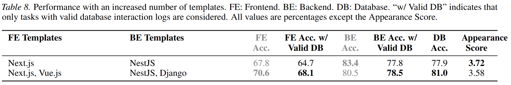

# FullStack-Agent

### Overview

This is the official repository for the paper "FullStack-Agent: Enhancing Agentic Full-Stack Web Coding via Development-Oriented Testing and Repository Back-Translation".
In this paper, we introduce **FullStack-Agent**, a unified system that combines a multi-agent full-stack development framework equipped with efficient coding and debugging tools ([FullStack-Dev](https://github.com/mnluzimu/FullStack-Dev)), an iterative self-improvement method that improves the abilities of LLMs through repository augmentation and back-translation ([FullStack-Learn](https://github.com/mnluzimu/FullStack-Learn)), and a full-stack development benchmark that comprehensively evaluates frontend, backend, and database functionalities ([FullStack-Bench](https://github.com/mnluzimu/FullStack-Bench)).

### Quick Start

Instructions for installation and running of the three components are in the following documents:

- [FullStack-Dev](https://github.com/mnluzimu/FullStack-Dev)

- [FullStack-Learn](https://github.com/mnluzimu/FullStack-Learn)

- [FullStack-Learn](https://github.com/mnluzimu/FullStack-Learn)

### Models

| Model Name | Huggingface Link |
|------------|------------------|
| FullStack-Learn-LM-30B-A3B| [luzimu/FullStack-Learn-LM-30B-A3B](https://huggingface.co/luzimu/FullStack-Learn-LM-30B-A3B) |

### Experimental Results

Experimental results of FullStack-Dev on [FullStack-Bench](https://github.com/mnluzimu/FullStack-Bench) compared to popular baseline methods are shown below:

The result of using more templates is presented below:

Using more templates result in better performance in most of the metrics, which might be due to the fact that with more templates to choose from, the agent can find the most appropriate and easy-to-work-with templates, thus making the development process smoother.

Experimental results of FullStack-Learn tested on with FullStack-Dev on FullStack-Bench are as follows:

